# ActividadDiagnostica
 
# INTEGRANTES
* Muñoz Lopez Kelvin Paul
* Pincay Gonzalez Manuel Jarod
* Reyes Carreño Jesús David 
* Yudeh Andres Branly  

# DIAGRAMA ENTIDAD RELACIÓN

# Asignacion
* Muñoz Lopez Kelvin Paul  -- unidades
* Pincay Gonzalez Manuel Jarod -- Mantenimiento
* Reyes Carreño Jesús David -- Usuarios
* Yudeh Andres Branly -- Repostaje

# Evidencias APP

# Complementario 1 

# Complementario 2

# Complementario 3
# 1) Aplicar servicio REST (aplicar por lo menos 2 métodos del CRUD) basado en la entidad transaccional asignada en su trabajo autónomo.
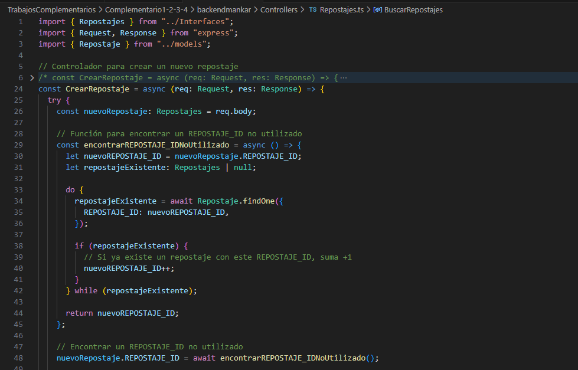
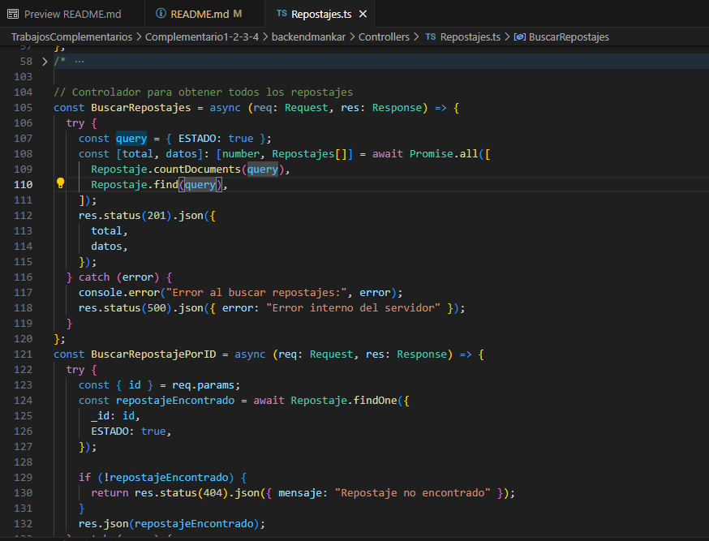

# 2) Aplicar por lo menos una prueba unitaria para los métodos del servicio REST

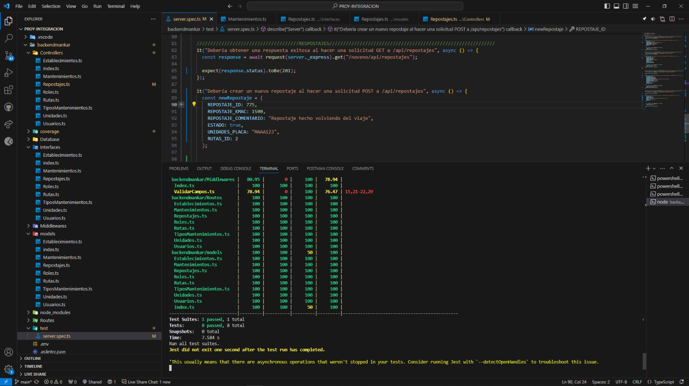

# 4) Definir un TAG que permita dockerizar tanto el servicio REST como sus pruebas en un solo stage (se aplica compilación normal de la imágen).
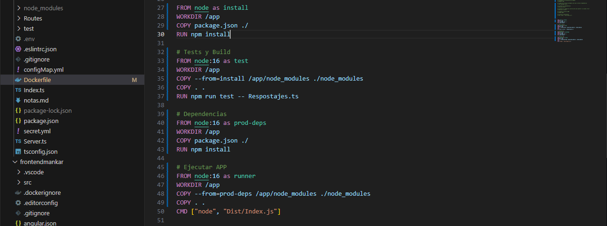
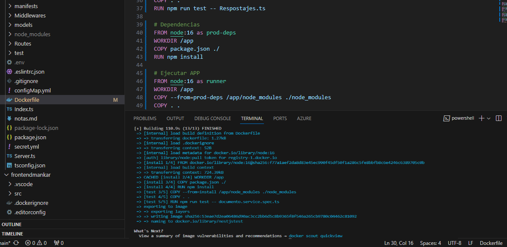

# 5) Subir ambos TAGs a Docker Hub como versiones de la misma imagen.

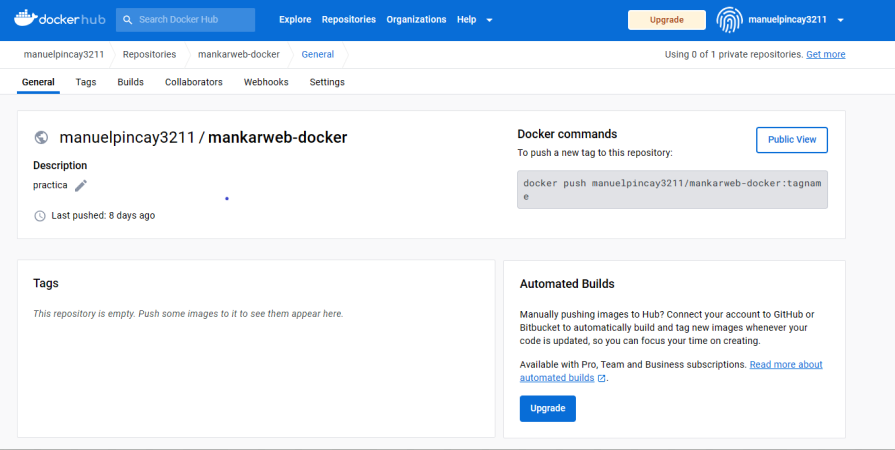
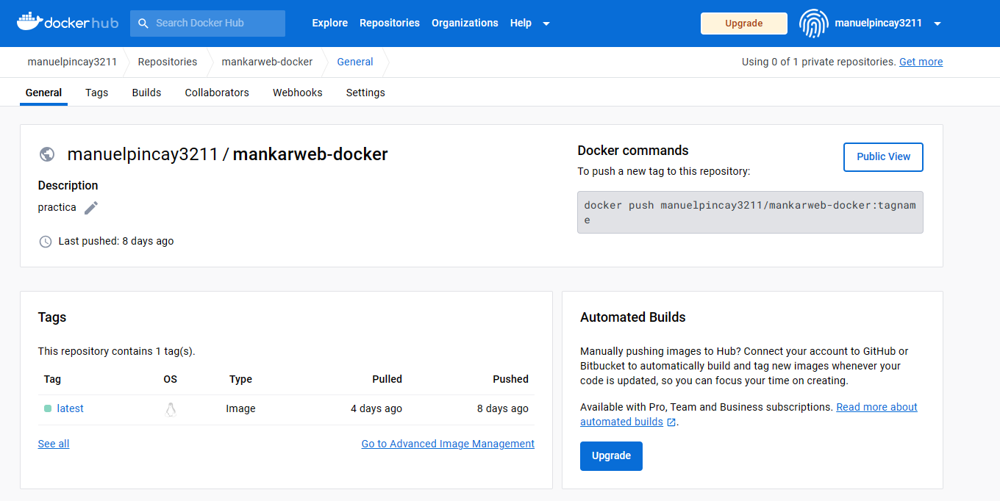
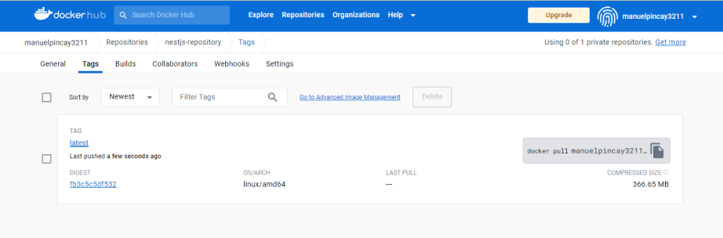

# 6)  Probar localmente la descarga y funcionamiento de dicha imagen publicada con anterioridad.
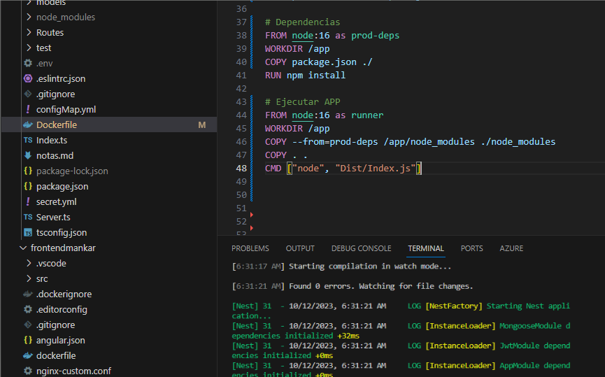

# 7) Aplicar patrón AAA en el desarrollo de sus pruebas
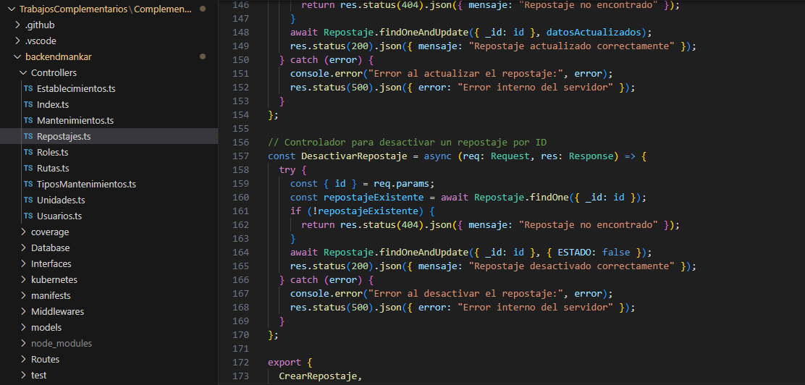
# Complementario 4

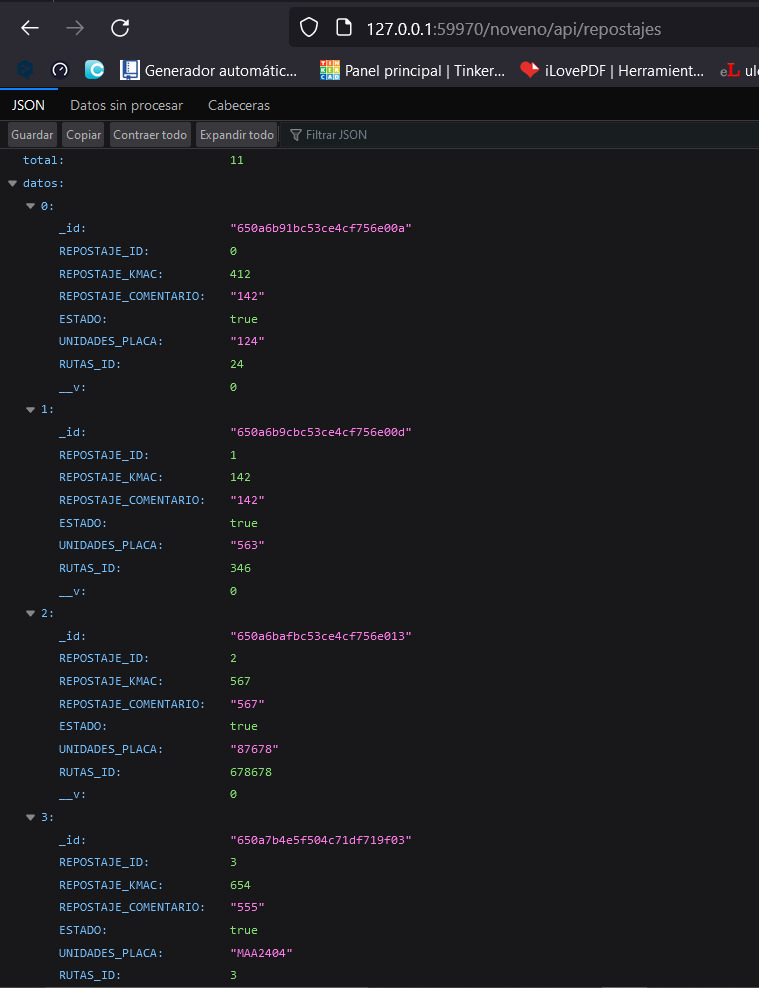

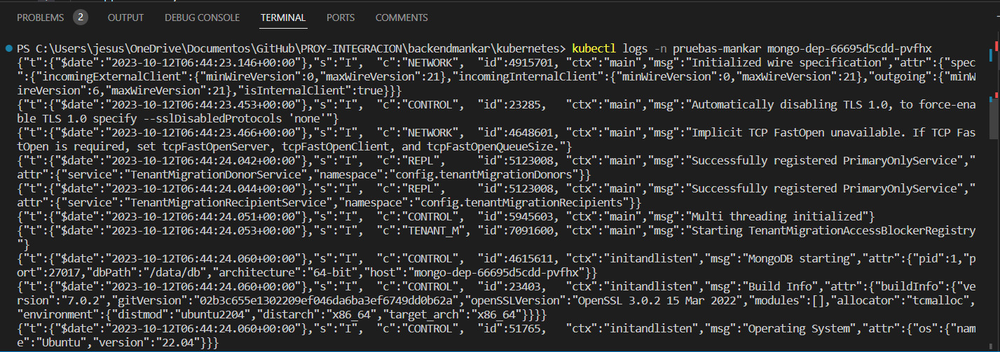

